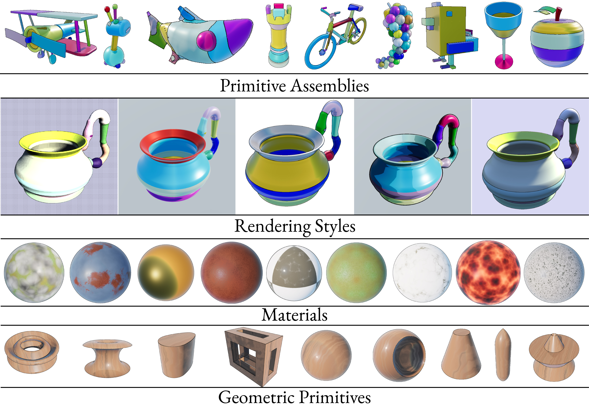
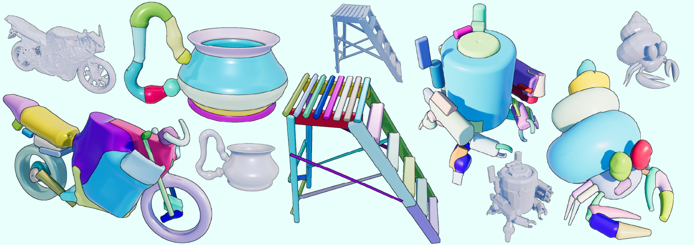
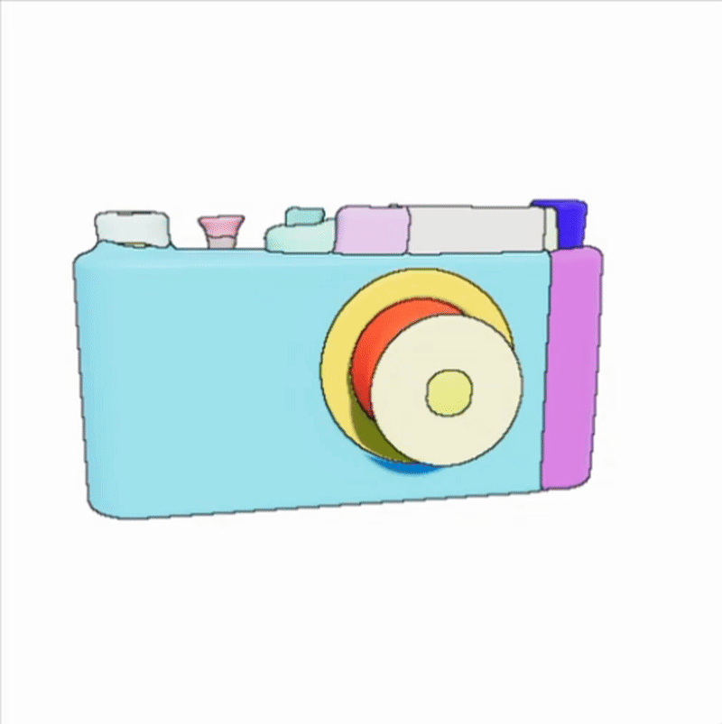
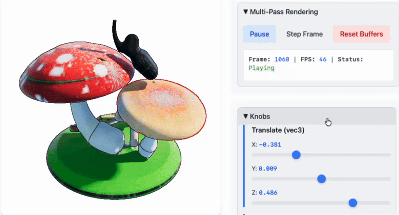
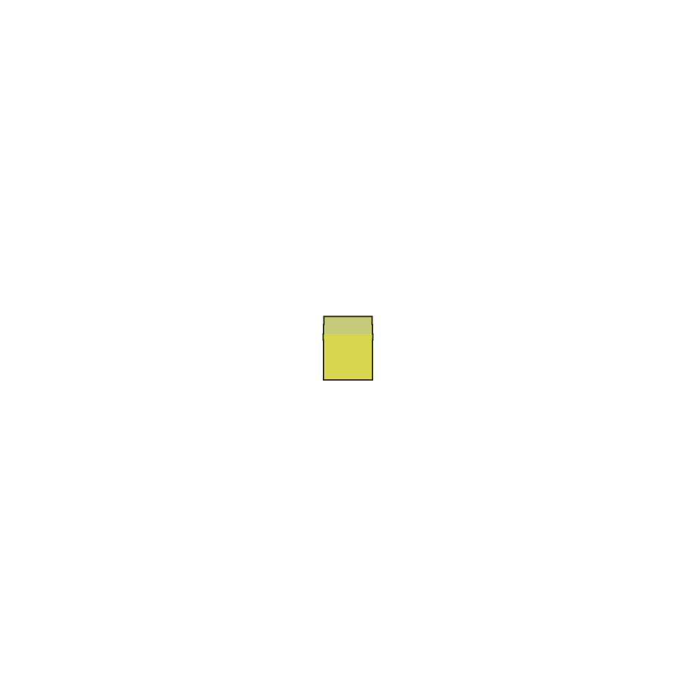

# SySL: Symbolic Scene Language

[](https://opensource.org/licenses/MIT)
[](https://www.python.org/downloads/)

**SySL** extends [GeoLiPI](https://github.com/bardofcodes/geolipi) by adding material-related symbols to geometric expressions. It provides an shader evaluation pipeline that converts symbolic scene expressions into GLSL shader code, enabling sphere-traced rendering and real-time interactive WebGL visualization.

<!-- TODO: Add hero image/GIF showing example renders -->
<p align="center">
  
</p>

## Applications

### 1. Paper-Ready Renders
Generate high-quality renders of primitive assemblies without mesh conversion. I used this system for rendering primitive assemblies for paper figures in a recent work [Residual Primitive Fitting of 3D Shapes with SuperFrusta](https://arxiv.org/abs/2512.09201). 

<!-- TODO: Add render comparison image -->
<p align="center">
  
</p>

### 2. Interactive Web Visualization
Create standalone HTML files for interactive 3D visualization. Useful for debugging, or stand alone apps. 

<!-- TODO: Add interactive demo GIF -->
<p align="center">
  
</p>

### 3. Interactive Assembly editor. 

Create an standalone app for editing *textured* (deployable) primitive assemblies. 

<p align="center">
  
</p>

### 4. Animation Sequences
Generate frame-by-frame renders for animations.

<!-- TODO: Add animation example -->
<p align="center">
  
</p>

## Features

- **Material Expressions**: Define materials with albedo, metallic, roughness, emissive properties
- **Multiple Render Modes**: From simple Inigo-style to PBR-quality Matthieu-style rendering
- **Shader Code Generation**: Convert symbolic expressions to optimized GLSL
- **Interactive Visualization**: Generate standalone HTML files with WebGL rendering
- **Jupyter Integration**: Inline visualization in notebooks
- **Offline Rendering**: Headless rendering via ModernGL (optional)
- **Image Effects (IMFX)**: Post-processing effects like outlines, dithering, anti-aliasing
## Installation

### Prerequisites
- Python 3.8+
- [GeoLiPI](https://github.com/bardofcodes/geolipi) (geometric expression library)

### From Source

```bash
# Clone the repository
git clone https://github.com/bardofcodes/sysl.git
cd sysl

# Install geolipi first (if not already installed)
# pip install geolipi  # or install from source

# Install SySL
pip install -e .
```

### Dependencies

```bash
pip install -r requirements.txt
```

## Quick Start

### Basic Example

```python
# TODO: Fill in working example
import geolipi.symbolic as gls
import sysl.symbolic as sls
from sysl.shader import evaluate_to_shader
from sysl.shader_runtime import create_shader_html

# Create geometry
geometry = gls.DeathStar3D((0.5,), (0.35,), (0.5,))

# Add materials  
material = sls.MatRefV4("MatLava")
scene_with_material = sls.MatSolid(geometry, material)

# Generate shader
shader_info = evaluate_to_shader(scene_with_material)

# Generate HTML
html_code = create_shader_html(shader_info, show_controls=True)

# Save to a file: 
with open("<path-to-webserver>/test.html", "w") as f:
    f.write(html_code)
# Now lauch a python server at that location and open test.html.
# for instance:
# cd <path-to-webserver>
# python -m http.server
#  -> open localhost:8000/test.html in a web browser.

#  If in Jupyter Notebook 
from IPython.display import display, HTML
from sysl.shader_runtime.generate_shader_html import make_jupyter_compatible_html
jupy_wrapper_html = make_jupyter_compatible_html(html_code)
display(HTML(jupy_wrapper_html))
```

### Jupyter Notebook

See `notebooks/` for examples.

## Render Modes

SySL supports multiple rendering pipelines, each with different visual characteristics:

| Mode | Description | Use Case | Source|
|------|-------------|----------|----------|
| **V1** | Simple Inigo-style | Fast preview, basic shading |[ShaderToy](https://www.shadertoy.com/view/Xds3zN)|
| **V2** | Inigo + Color | Simple colored renders | [ShaderToy](https://www.shadertoy.com/view/Xds3zN)|
| **V3** | J. Matthieu-style | Material functions with (p, n) |[ShaderToy](https://www.shadertoy.com/view/3tKfDG)|
| **V4** | Adapted Matthieu | Local materials + mixing (default) |[ShaderToy](https://www.shadertoy.com/view/3tKfDG)|
| **V5** | Toon Shader | NPR stylized rendering |[ShaderToy](https://www.shadertoy.com/view/ll33Wn)|
| **V6** | Dithered Shader | V2 + Dithering + outline |[ShaderToy](https://www.shadertoy.com/view/33BXW3)|

### Selecting a Render Mode


```python
settings = {
    "render_mode": "v4",  # Options: v1, v2, v3, v4, v5, v6
    "variables": {
        "castShadows": True,
        "_AA": 2,  # Anti-aliasing factor
    }
}

shader_code, uniforms, textures = evaluate_to_shader(expression, settings=settings)
```

## Image Effects (IMFX)

Post-processing effects available in multi-pass rendering:

- **Outlines**: Edge detection for shape boundaries

- **Selection Highlight**: Highlight specific primitives (used in editing mode)
- **Dithering**: Stylized dither patterns

- **FXAA**: Fast approximate anti-aliasing

## Project Structure

```
sysl/
├── sysl/
│   ├── symbolic/        # Material symbols and MatSolid definitions
│   ├── shader/          # Expression → GLSL shader conversion
│   │   ├── shader_templates/  # GLSL template modules
│   │   └── utils/       # UBO packing, texture encoding
│   ├── shader_runtime/  # HTML generation, offline rendering
│   └── torch_compute/   # PyTorch-based evaluation (optional)
├── scripts/             # Example scripts
├── notebooks/           # Jupyter notebook examples
└── assets/              # Images for documentation
```

## Acknowledgments

This project builds heavily on the excellent work from the ShaderToy community:

- **Inigo Quilez** ([iquilezles.org](https://iquilezles.org/)) - SDF primitives, combinators, and basic sphere tracing / rendering techniques
- **Matthieu Jacquemet** ([ShaderToy](https://www.shadertoy.com/view/3tKfDG)) - A material system + alternate rendering system.

> **Important License Note**: The MIT license applies to the Python code in this repository. The GLSL shader templates are derived from ShaderToy contributions and retain their original authors' licensing terms. Please respect the original authors' licenses when using generated shader code.

## Citation

If you use SySL in your research, please cite:

```bibtex
@misc{ganeshan2025superfit,
  title={Residual Primitive Fitting of 3D Shapes with SuperFrusta}, 
  author={Aditya Ganeshan and Matheus Gadelha and Thibault Groueix and Zhiqin Chen and Siddhartha Chaudhuri and Vladimir Kim and Wang Yifan and Daniel Ritchie},
  year={2025},
  eprint={2512.09201},
  archivePrefix={arXiv},
  primaryClass={cs.GR},
  url={https://arxiv.org/abs/2512.09201}, 
}

@article{ganeshan2025migumi,
  author = {Ganeshan, Aditya and Fleischer, Kurt and Jakob, Wenzel and Shamir, Ariel and Ritchie, Daniel and Igarashi, Takeo and Larsson, Maria},
  title = {MiGumi: Making Tightly Coupled Integral Joints Millable},
  year = {2025},
  publisher = {Association for Computing Machinery},
  volume = {44},
  number = {6},
  url = {https://doi.org/10.1145/3763304},
  doi = {10.1145/3763304},
  journal = {ACM Trans. Graph.},
  articleno = {193},
}
```

## Known Limitations & Future Work

- **Code Duplication**: Shader templates have some duplication that could be refactored
- **Complex Scenes**: Very complex scenes may benefit from cone tracing (not yet implemented)
- **WebGPU**: Currently WebGL only; WGPU support planned
- **Configuration Persistence**: Saving/loading editor configurations not yet supported

See `sysl/shader/shader_templates/future_shaders.md` for planned shader additions.

## License

This project is licensed under the MIT License - see the [LICENSE](LICENSE) file for details.

**Note**: Shader templates derived from ShaderToy retain their original licensing.

## Contact

- **Issues**: [GitHub Issues](https://github.com/bardofcodes/sysl/issues)
- **Email**: [adityaganeshan@gmail.com](mailto:adityaganeshan@gmail.com)

---

*This project is under active development. APIs may change between versions.*
